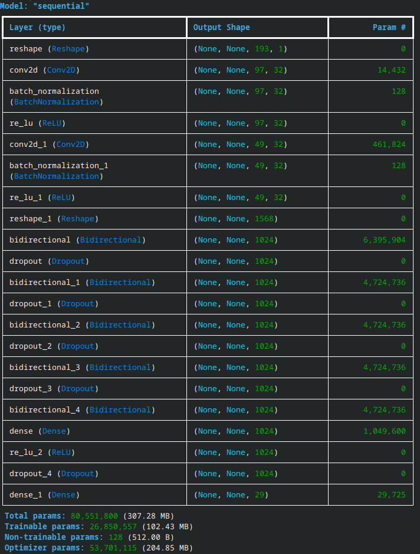

# Speech Recognition
## Introduction
This library allows you to train your own Speech Recognition model, and utilize it in Unity.

## Required Libraries
The following are the required libraries you need to install to utilize the training python scripts, and to integrate the model into untiy.

Python scripts require:
<ul>
    <li>tensorflow</li>
    <li>numpy</li>
    <li>pandas</li>
    <li>matplotlib</li>
    <li>jiwer</li>
    <li>os</li>
    <li>Sys</li>
    <li>csv</li>
    <li>re</li>
</ul>

## Model Architecture
This model utilizes The Deepspeech 2 actitecture
    https://nvidia.github.io/OpenSeq2Seq/html/speech-recognition/deepspeech2.html
    
    https://github.com/NVIDIA/OpenSeq2Seq/blob/master/example_configs/speech2text/ds2_small_1gpu.py

Located in the SpeecRecogntion/Training directory is the License for the Deepspeech 2 model.

## Training
The training process requires three csv files; Training.csv, Validation.csv, and Test.csv. As the names imply, these csv 
files should contain the Training, Validation, and Test datasets. They should have the following file structure: 
    filename,transcript, 
    /complete/path/to/wav/file.wav,Transcript of wav file 

Please note: all wav files used in the Training, Validation, and Testing datasets should have the same sample rates. In
our case, that would be 16000 samples.

Certain parameters can be modified within the 'config.ini'. For example, we can enable or disable data augmentation for 
the Training dataset. The augmentation includes Additive Nnoise, Time Streching, and Volume Modulation. You can modify the
vocabluary to include punctuation or special characters depending on the use case. And you can modify the Learning Rate and
Early stop parameters.

Please note: Before you start the training process, please ensure that the paths to where you wish to save the model, 
figures, and checkpoints are filled out.

For our model, we used the Librispeech dataset with the following setup:
*Round 1*: We utilized the 100 dataset for our Training data, the combined Dev-clean and Dev-other datasets for our 
Validation data, and the combined Test-clean and Test-other for our Test data. We had the following values for data 
augmentation of the 100 dataset: *noise_min and noise_max were set to 30 and 20, time_strech_ratio was set to 5, and 
Volume was set to 0.*

*Round 2*: We utilized the 360 Dataset for our Training data. The Validation and Testing Dataset remained the same. We had 
the following values for data augmentation of the 360 dataset: *noise_min and noise_max were set to 45 and 20, 
time_strech_ratio was set to 10, Volume was set to 5.*

*Round 3*: We utilized the 500 Dataset for our Training data *without any augmentation.* The validation and Testing Datasets 
remained the same.

*Each round consisted of 50 Epochs.*

Once the csv files and the config.ini file are ready, run the following cmd to start the training process (Please be sure
to center on the Training directory):

    python -m Model.TrainASRModel TrainingDataset.csv ValidationDataset.csv TestDataset.csv

### Compiling the API
Run this cmd to compile the API script into an executable form

    pyinstaller --onefile --add-data "models/ASR.keras:models" --add-data "Data/Process.py:Data" --add-data "Model/ASRModel.py:Model" --add-data "Grab_Ini.py:." --add-data "config.ini:." API/ASR_API.py

### Diagrams

## Usage

### Diagrams
